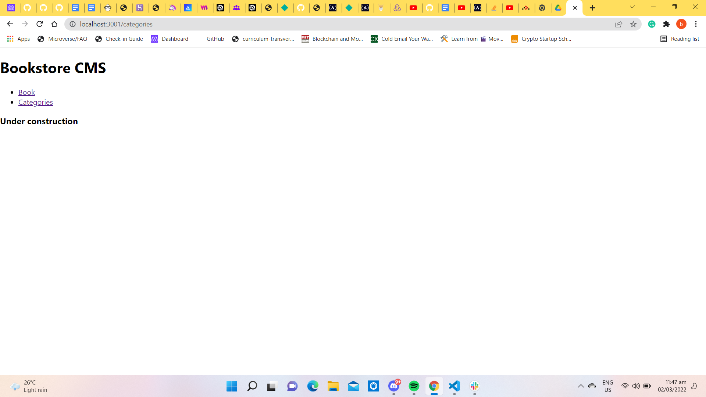

# Math Magicians

> This is a bookstore app created with React and Redux.
## Built With

- HTML
- CSS
- JavaScript
- React & Redux
## How to use and run this project

>To get a local copy up and running follow these simple example steps.

- Clone this repository with

git clone https://github.com/butlermuwo/bookstore.git using your terminal or command line.

- Change to the project directory by entering :

cd math-magians in the terminal.

- run code . to open it in vscode
- Install packages using the command npm install
- run the project locally by entering the command npm start

## Project Status
This project is in progress.

## Screenshoots

## Live Demo()
[Live Demo Link](https://bookstore-muwo1.herokuapp.com/)
## Authors

👤 **Author1**

- GitHub: [@ButlerMuwo](https://github.com/butlermuwo)
- Twitter: [@ButlerMuwo](https://twitter.com/ButlerMuwo)
- LinkedIn: [@ButlerMuwo](https://www.linkedin.com/in/butler-shimaluwani-41a680159/)

## 🤝 Contributing

Contributions, issues, and feature requests are welcome!

Feel free to check the [issues page](https://github.com/butlermuwo/bookstore/issues).

## Show your support

Give a ⭐️ if you like this project!

## Acknowledgments

- Thanks to everyone that helping
## 📝 License

This project is [MIT](./MIT.md) licensed.